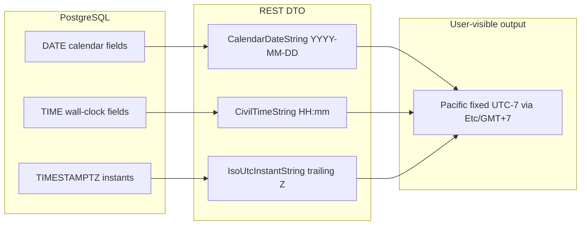

# Dates and timezones

This is the cross-cutting contract for how the corp calendar handles dates and
times. Read this before adding fields, formatters, schedulers, or display
strings that involve calendar days or wall-clock times.

The same rules apply across `calendar-service`, `calendar-ui`, `@corpcal/shared`,
and `@corpcal/database`.

## TL;DR

1. We model **three** datetime concepts and never mix them: `CalendarDate`,
   `CivilTime`, and `Instant`.
2. The single business display zone is **corp Pacific Time, fixed UTC&minus;7,
   year-round (no DST)**. We format with **`Etc/GMT+7`** (fixed offset). We do not
   use **`America/Vancouver`** today; tzdb **2026b** already models BC as permanent
   UTC&minus;07 there (see **Why fixed UTC−7** below).
3. Use the helpers in `@corpcal/shared` (the `datetime` module) for everything
   that is shown to a user, bucketed by day, or compared across requests.
4. Never call `new Date('YYYY-MM-DD')` or `toLocaleDateString()` /
   `toLocaleTimeString()` without an explicit `timeZone` for user-visible output.
5. CI runs with `TZ=UTC` (GitHub) and OpenShift containers run with `TZ=UTC`.
   Tests must pass without setting `TZ=America/Los_Angeles` locally.

## Concepts

### 1. `CalendarDate`

A specific calendar day with no time and no timezone, e.g. `2026-04-27`. This
is a label for "the scheduled day" in the corp calendar. It is the right type
for activity `startDate`, `endDate`, and `pitchDate`.

- **Wire format**: `YYYY-MM-DD` string.
- **Database**: PostgreSQL `DATE` (timezone-agnostic).
- **TypeScript**: `CalendarDateString` (branded alias of `string`) from
  `@corpcal/shared`.
- **Comparison**: lexicographic string compare is correct
  (`'2026-04-27' < '2026-04-28'`).
- **Arithmetic**: use `addCalendarDays` from `@corpcal/shared/datetime` (do not
  build a `Date`, mutate, then format).

### 2. `CivilTime`

A wall-clock time meant to combine with a `CalendarDate` to describe "the
scheduled time of day", e.g. `09:30`. It is the right type for activity
`startTime` and `endTime`.

- **Wire format**: `HH:mm` string (24-hour, zero-padded).
- **Database**: PostgreSQL `TIME` (no zone).
- **TypeScript**: `CivilTimeString` (branded alias of `string`) from
  `@corpcal/shared`.
- **Semantics**: civil times in our app are interpreted in **Pacific
  fixed UTC&minus;7**, not in the viewer's local timezone. Documentation,
  admin copy, and DTO field descriptions must say so.

### 3. `Instant`

An exact moment in time, the same value for every observer. Think audit and
optimistic-concurrency timestamps such as `createdDateTime`,
`lastUpdatedDateTime`, `news_release_date_time`.

- **Wire format**: ISO 8601 with the trailing `Z`, e.g.
  `2026-04-27T15:30:00.000Z`.
- **Database**: PostgreSQL `TIMESTAMPTZ` (UTC-backed).
- **TypeScript**: `IsoUtcInstantString` (branded alias of `string`) from
  `@corpcal/shared`.
- **Logging**: log instants in UTC ISO. Never attribute meaning to
  `process.env.TZ` for log timestamps.
- **Display**: format in **corp Pacific fixed UTC&minus;7** using the shared
  formatters.



## Why fixed UTC&minus;7 (and `Etc/GMT+7` vs `America/Vancouver`)

The product rule today is: the corp calendar always operates as **Pacific Time
fixed UTC&minus;7, no daylight saving**. This matches the pre-existing logic in
`packages/shared/src/activity-completion.ts` and
`packages/shared/src/look-ahead-reset.ts`, which interpret activity scheduling
in fixed UTC&minus;7 (no DST shifts).

**Tzdb 2026b** encodes British Columbia staying on **permanent UTC&minus;7**
after its last spring-forward on **2026-03-08** (legal effective **2026-03-09**
per release notes). **`America/Vancouver` therefore no longer implies seasonal
DST changes** in current data for future timestamps. However, **2026b
temporarily models the switch to permanent UTC&minus;7 at 2026-11-01 02:00**
rather than on the legal date—a **CLDR v48.2** workaround that maintainers
**plan to remove after CLDR is fixed**.
See the [2026b tz-announce message](https://lists.iana.org/hyperkitty/list/tz-announce@iana.org/thread/VX2Z3CBO6KHTYZNBBKFFWM7ZCI6TVCXP/).

We still use **`Etc/GMT+7`** for `Intl` formatting because it is a plain fixed
offset: no dependence on BC legislation updates or on Vancouver’s temporary CLDR
alignment hack.

> **Important - IANA inverted sign.** In the IANA tz database, `Etc/GMT+N`
> uses an **inverted** sign relative to POSIX-style offsets:
>
> - `Etc/GMT+7` is **UTC&minus;7** (what we want)
> - `Etc/GMT-7` is **UTC+7** (a 14-hour bug)
>
> See the [IANA Time Zone Database](https://www.iana.org/time-zones) for
> authoritative documentation. Do not rely on third-party "timezone list"
> sites for correctness.

If product switches display from **`Etc/GMT+7`** to **`America/Vancouver`**, keep
**ops discipline**: ship current **`tzdata`** in base images and Node, and validate
**`Intl`/CLDR** behavior—especially around **2026b’s temporary 2026-11-01
transition modeling** vs the legal **2026-03-09** effective date until upstream
removes the workaround. Today **`Etc/GMT+7`** remains the documented choice.

A single optional config concept (e.g. `APP_TZ_MODE=fixed | iana` plus
`APP_TZ=Etc/GMT+7 | America/Vancouver`) can be introduced later if needed; it
is not required for the current implementation.

## Where the helpers live

All shared helpers live in `@corpcal/shared` under the `datetime` module:

```ts
import {
  // Calendar arithmetic
  addCalendarDays,
  CORP_PACIFIC_LABEL, // 'Pacific Time (UTC-7, no daylight saving)'
  CORP_PACIFIC_OFFSET_MS, // 7 * 60 * 60 * 1000
  // Constants
  CORP_PACIFIC_TIME_ZONE, // 'Etc/GMT+7'
  formatCalendarDateCover,
  formatCalendarDateHeading,
  // Formatting
  formatCalendarDateLong,
  formatCalendarDateShort,
  formatCivilTime12h,
  formatInstantInPacific,
  formatInstantPacificDate,
  formatInstantPacificTime,
  formatPacificFooterTimestamp,
  // Validators / parsers
  isCalendarDateString,
  isCivilTimeString,
  // Bucketing
  pacificCalendarDateFromInstant,
  pacificDayKey,
  toCalendarDateString,
  toCivilTimeString,
  // Branded types
  type CalendarDateString,
  type CivilTimeString,
  type IsoUtcInstantString,
} from '@corpcal/shared';
```

Calendar-service, calendar-ui, and packages/shared internals must use these
helpers instead of constructing `Date` objects from `YYYY-MM-DD` strings or
calling `toLocaleDateString` / `toLocaleTimeString` without `timeZone`.

## Wire contract for the API

- `startDate`, `endDate`, `pitchDate`: `CalendarDateString | null`
  (`YYYY-MM-DD`).
- `startTime`, `endTime`: `CivilTimeString | null` (`HH:mm`).
- `createdDateTime`, `lastUpdatedDateTime`, and other instants:
  `IsoUtcInstantString` (`...Z`).

The `ActivityResponse` Zod schema validates these fields as strings; the
branded aliases give us extra TypeScript safety without changing the wire
shape.

## Database driver and mapper

Drizzle's `date()` column type returns a `string` (`YYYY-MM-DD`) by default
with `postgres-js`. The mapper layer must keep that string and not silently
convert it to a JS `Date`:

```ts
// packages/shared/src/datetime/mapper.ts
toCalendarDateStringFromDb(value: string | Date | null): CalendarDateString | null
```

This helper does string pass-through when the driver returns a string, and
falls back to UTC date components when a JS `Date` arrives (without using
`toISOString().split('T')[0]` on a value that may have been re-interpreted in
host local time).

## Logging

- Log timestamps in UTC ISO (`new Date().toISOString()`).
- Never rely on `process.env.TZ` for the meaning of a logged timestamp.
- Job traces that mention "today" must format with `formatInstantInPacific` so
  they read as "Pacific business day" regardless of the host TZ.

## Testing

- CI runs with `TZ=UTC` and tests must pass without local TZ overrides.
- Shared formatter and bucketing tests run a **TZ matrix smoke**: same
  assertions are evaluated under `TZ=UTC` and `TZ=America/New_York` and must
  produce identical output.
- A small **timezone health check** test pins a few fixed instants and asserts
  they map to known Pacific output strings; this guards against accidental
  regressions.
- Snapshot tests that include rendered dates must rely on the corp helpers
  with explicit `timeZone`. Anything that calls `toLocale*` without `timeZone`
  is a bug.

## Anti-patterns to avoid

- `new Date('2026-04-27')` to mean "April 27 at local midnight". ISO date-only
  strings are parsed as UTC, which shifts behind UTC. Use
  `pacificCalendarDateFromInstant` if you need an instant, or keep the value
  as a `CalendarDateString`.
- `someInstant.toLocaleDateString()` (no `timeZone`) for user-visible output.
  This depends on `process.env.TZ` and varies between dev laptops and CI /
  OpenShift. Pass `{ timeZone: CORP_PACIFIC_TIME_ZONE }`.
- Ad hoc day-bucket helpers that build a `Date` from an ISO string and read
  `getFullYear` / `getMonth` / `getDate` (host-local getters). Use
  `pacificDayKey(...)` (print code re-exports this as `dateKeyLocal` from
  `@corpcal/shared/reports/print/react`).
- `format(d, 'yyyy-MM-dd')` (date-fns) on a JS `Date` derived from a
  `CalendarDateString`. Keep the original string and pass it through.
- Storing wall-clock-only fields in `TIMESTAMPTZ`. Use `TIME` and `DATE`
  separately and combine them only when computing instants.

## Related references

- [`packages/shared/src/datetime/index.ts`](../packages/shared/src/datetime/index.ts) - the shared module.
- [`packages/shared/src/activity-completion.ts`](../packages/shared/src/activity-completion.ts) - effective-end and Pacific gating for cron.
- [`packages/shared/src/look-ahead-reset.ts`](../packages/shared/src/look-ahead-reset.ts) - daily Pacific reset window.
- [`docs/CALENDAR_SERVICE_SCHEDULED_JOBS.md`](./CALENDAR_SERVICE_SCHEDULED_JOBS.md) - cron / advisory-lock summary.
- [IANA Time Zone Database](https://www.iana.org/time-zones) - authoritative tzdb distribution.
